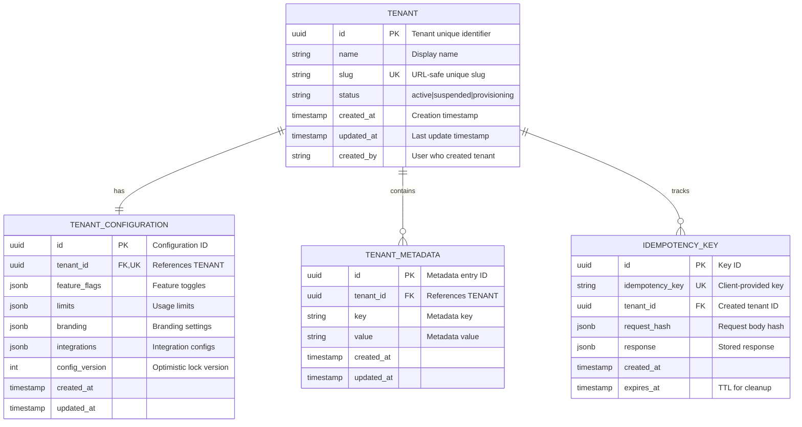

# Tenant Entity Schema Design

## Overview

This document describes the schema design for tenant provisioning, including entity relationships, PostgreSQL DDL, and MongoDB collection schemas.

## Entity Relationship Diagram

## PostgreSQL DDL

See `tenant-schema.sql` for complete DDL statements.

## MongoDB Collection Schema

See `tenant-schema-mongodb.json` for MongoDB validator schema.

## Partition Strategy

- **tenant_id** serves as the partition/shard key for all tenant-scoped tables
- All queries must include tenant_id to ensure proper routing
- Cross-tenant queries are restricted to platform_admin role only

## Indexing Strategy

### PostgreSQL
- Primary key indexes on all `id` columns
- Unique index on `tenants.slug`
- Unique index on `tenant_configurations.tenant_id`
- Composite index on `tenant_metadata(tenant_id, key)`
- Unique index on `idempotency_keys.idempotency_key`
- Partial index on `idempotency_keys.expires_at` for cleanup

### MongoDB
- Unique index on `_id` (tenant_id)
- Unique index on `slug`
- Index on `status` for filtering
- TTL index on idempotency collection for automatic expiration
