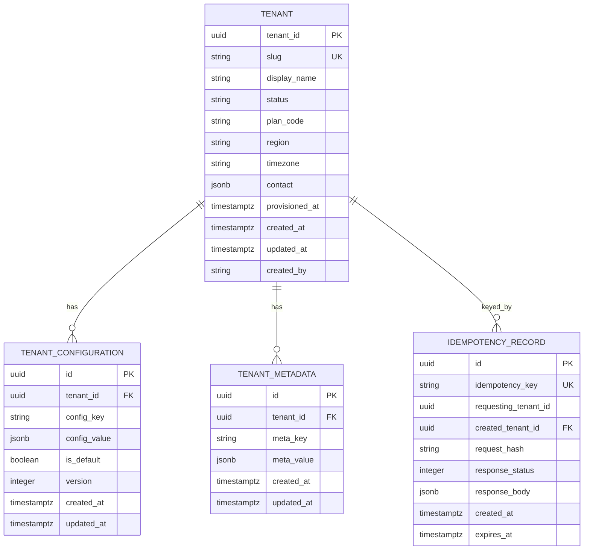

# Tenant Entity Schema and Default Configuration Model

**Story:** Build Automated Tenant Provisioning and Configuration Service  
**Story ID:** `486d3e38-2cec-40cb-874d-576d2147732c`  
**Task:** Design tenant entity schema and default config model (`89d8dbba-19a6-4a35-8382-d1be49c1fcf0`)

## 1. Purpose

Define the canonical relational and document models for tenant lifecycle data in
ASIWDP. Every tenant-scoped row/document is partitioned by `tenant_id` so
downstream services can enforce isolation at the storage layer.

## 2. Entity-relationship diagram

## 3. Partition / isolation key

| Store | Partition key | Notes |
|-------|---------------|-------|
| PostgreSQL | `tenant_id UUID NOT NULL` | Leading column on all tenant-scoped indexes |
| MongoDB | `tenant_id` (UUID string) | Shard key / compound index prefix on all collections |

Platform catalog tables (`tenant`, `idempotency_record`) are global but always
reference the created `tenant_id`. Child config/metadata documents are strictly
tenant-partitioned.

## 4. Default configuration model

On successful provisioning the service seeds a default configuration set:

| Key | Default value | Purpose |
|-----|---------------|---------|
| `locale` | `en-US` | UI / content locale |
| `timezone` | tenant timezone or `UTC` | Scheduling & analytics windows |
| `features.skills_framework` | `true` | Skills taxonomy enabled |
| `features.recommendations` | `true` | Recommendation engine enabled |
| `features.learning_paths` | `true` | Learning path service enabled |
| `privacy.consent_required` | `true` | GDPR/CCPA consent gate |
| `privacy.data_residency` | tenant region or `us-east-1` | Residency hint |
| `rbac.default_learner_role` | `learner` | Role assigned to new learners |
| `metering.usage_events_enabled` | `true` | Emit usage telemetry |

Configuration values are stored as JSON so tenants can override without schema
migrations. `is_default=true` marks seed rows; later updates bump `version`.

## 5. Artifacts

| Artifact | Path |
|----------|------|
| PostgreSQL DDL | [`db/postgres/sql/V1__create_tenant_schema.sql`](../../db/postgres/sql/V1__create_tenant_schema.sql) |
| MongoDB validators | [`db/mongodb/collections/`](../../db/mongodb/collections/) |
| MongoDB init script | [`db/mongodb/init/create_tenant_collections.js`](../../db/mongodb/init/create_tenant_collections.js) |
| Provisioning event schema | [`docs/design/tenant-provisioning-event.md`](tenant-provisioning-event.md) |
